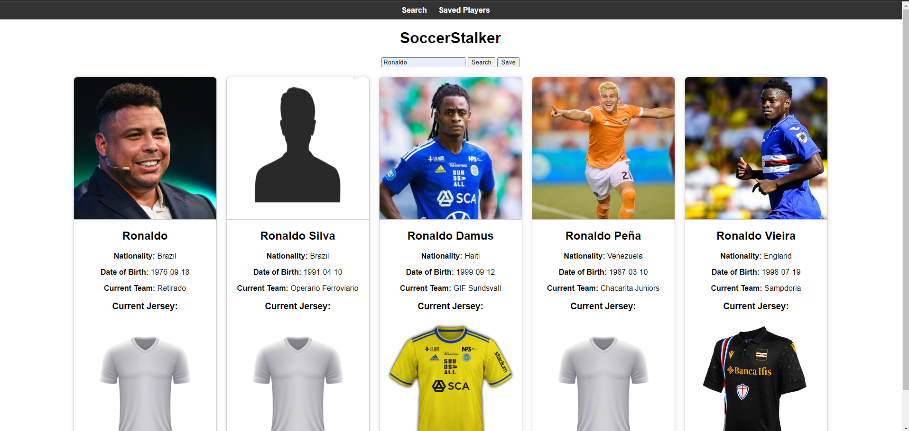
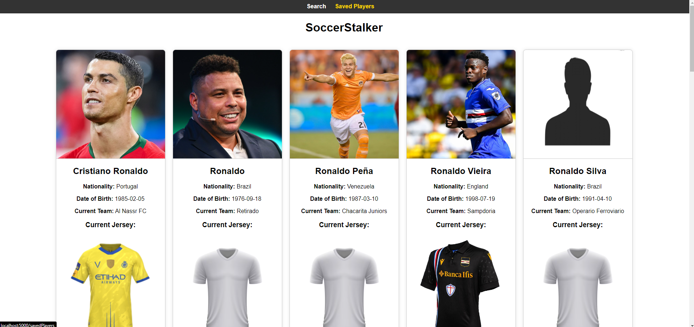

# Prueba técnica para Elogia

En este repositorio se encuentra uno de los ejercicios que me mandaron para la ya dicha prueba técnica.
El ejercicio consiste en crear una pequeña aplicación web que te permita buscar jugadores de fútbol y guardar sus resultados si se quiere.

Para ello, me han proporcionado la API "Free Sports API", la cual utilizaré para dar los resultados de los jugadores.

## Requisitos

La mini app tendrá un formulario con un campo de texto y dos botones: buscar y guardar.

    1. Al hacer clic en el botón buscar, se buscará el texto en la base de datos de jugadores (Método de API “Search for players by name”)

    2. Se mostrarán los 5 primeros resultados en formato de ‘tarjetas’ con diseño personalizado con los datos del jugador. Solamente deben mostrarse los jugadores cuyo deporte sea el fútbol (strSport = ‘Soccer’). Los datos mínimos que deben mostrarse en las tarjetas son el Nombre completo, Imagen, Nacionalidad, Fecha de nacimiento y Equipo actual

    3. Mostrar también la primera equipación actual de su equipo (Utilizar el método de la API “Lookup Equipment by Team ID”)

    4. Al hacer clic en el botón guardar, se almacenarán los resultados en una base de datos

    5. La mini app tendrá una sección donde poder consultar las búsquedas guardadas

La aplicación debe ser desarrollada en PHP o JavaScript. Se puede utilizar cualquier tipo de framework para facilitar el trabajo como Nodejs, Laravel, React, Vue.js, etc.

A la hora de almacenar los datos también se puede utilizar cualquier base de datos como (MySQL, MongoDB, PostgreSQL o Big Query).

## Empieza el desarrollo

Para empezar el desarrollo decidí elegir qué tecnologías utilizaría entre las opciones que me habían dado, siendo mi elección final Javascript y Nodejs para el desarrollo y MongoDB como base de datos.

A continuación decidí ver cómo funciona la API proporcionada llamada "Free Sports API" utilizando Postman y probar los métodos que se mencionaban.
- “Search for players by name” 

    Endpoint de la API al que le pasas el nombre de un jugador y te devuelve todos los resultados coincidentes.
- “Lookup Equipment by Team ID”

    Endpoint de la API al que le pasas el ID de un equipo y te devuelve sus equipaciones

Estos dos son los endpoints utilizados de la API proporcionada.

En cuanto a la estructuración de las carpetas para el proyecto, decidí dividirlo en "Backend" y "Frontend":

1. Backend:

    1.1 routes: Las rutas para la API propia utilizada en este proyecto se dividió en dos "player" y "search". "player" son los endpoint de consulta en la base de datos MongoDB y "search" son las búsquedas en la API proporcionada.
    
    1.2 models: Considere que solo era necesario el modelo "player" para almacenar los jugadores en la base de datos.

    1.3 controllers: Dentro de esta carpeta se encuentran los métodos utilizados para cada endpoint.

    1.4 db.js: Código para inicializar la base de datos MongoDB.

    1.5 server.js: Aquí se encuentra la creación del servidor utilizado para la app.

2. Frontend

    2.1 src: Recursos utilizados durante la ejecución de la app. Por ejemplo el icono.
    
    2.2 styles: Aquí se encuentra el archivo css para estilar la app.

    2.3 index: El archivo .html y .js con todo lo utilizado para la página principal.

    2.4 savedPlayers: El archivo .html y .js con todo lo utilizado para la página donde se ven los jugadores guardados en la base de datos.

## Como funciona
Para iniciar el proyecto tienes que entrar en la carpeta "backend" y utilizar el comando "node server.js"
Como se pedia en los requisitos de la prueba, cuando escribes un nombre y lo buscas te salen las tarjetas con los datos de los 5 primeros jugadores encontrados en la API.
Y en la otra ventana te salen todos los jugadores almacenados en la base de datos.

## Como se ve
- Página principal:

- Página de jugadores guardados:

## Consideraciones

- En la API proporcionada existen jugadores que no tienen una foto suya, como es el caso de "Ronaldo Silva" en la imagen de la sección anterior. Por ello opté por poner en su lugar una silueta.

- Lo mismo ocurre con las camisetas, existen equipos que no tienen sus camisetas en la API por lo que se optó por que en su lugar apareciera una camiseta blanca sin estampado.

- Además, con jugadores que están retirados o fallecidos, no tienen camiseta, por lo tanto, se hizo lo mismo que en el caso anterior.

- Considere que era mejor que para guardar los jugadores era necesario buscarlos primero, para así poder evitar posibles errores del usuario.

- También le puse un nombre a la APP, para referirme a la misma. El nombre elegido fue "SoccerStalker".

## Puntos de mejora
- Mejorar el estilo de la página, ya que es muy básico.

- Diferenciar las camisetas de un jugador retirado/fallecido, de las que no estén disponibles en la API.

- El botón de guardar en lugar de estar arriba y que guarde todos los resultados de la búsqueda, ponerlo dentro de la tarjeta y que guarde únicamente ese jugador.

- Paginar los resultados de la ventana de jugadores guardados y no mostrar todos a la vez, ya que en caso de tener muchos jugadores guardados puede llegar a ser un problema.

